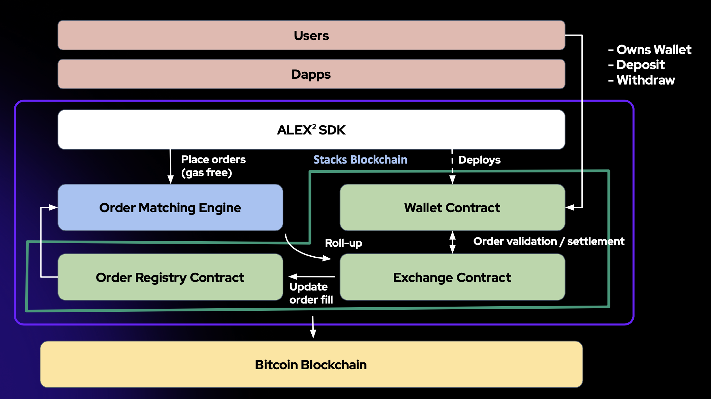

# ALEX Orderbook

The first version of ALEX Orderbook, an order matching protocol for peer to peer exchange of digital assets written in Clarity.

The protocol only facilitates order matching, which means that the actual order generation and order books are managed off-chain. Users will first deploy a wallet contract and deposit their digital assets into it. They then sign order structs in order to trade.

*More information to follow.*

## Setup

Setup is not required, but a few helper scripts exist that require you to install packages.

```bash
npm install
```

## Helper scripts

**Generate an order hash from order JSON**
```bash
npm run generate-order-hash "<order JSON>"
```

**Convert a seed to a private key for testing**
```bash
npm run seed-to-private-key "seed phrase"
```

**Sign order hash using a private key**
```bash
npm run sign-order-hash <private key> <order hash>
```

## Tests

Two rudimentary test files exist. They can be executed as follows:

```bash
clarinet test tests/*
```

or

```bash
npm test
```

## Order authorisation

Orders pass the authorisation step if one of the following four conditions is met:

1. The order was partially filled before. This means one of the following validations had passed before.
2. The `tx-sender` is equal to the maker of the order.
3. The order was pre-approved by the maker.
4. The order is properly signed by the maker.

## Order struct

```lisp
	{
	sender: uint,
	sender-fee: uint,
	maker: uint,
	maker-asset: uint,
	taker-asset: uint,
	maker-asset-data: (buff 256),
	taker-asset-data: (buff 256),
	maximum-fill: uint,
	expiration-height: uint,
	extra-data: (buff 256),
	salt: uint
	}
```

## Diagram


